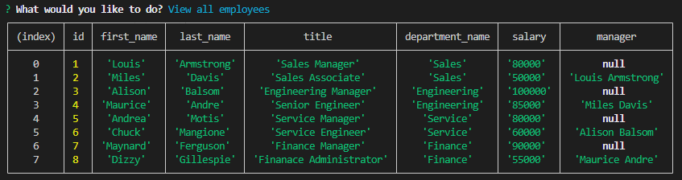

    
# Employee Tracker


    
## Description
    
The application allows the user to add and delete notes.

## Table of Contents 

* [Installation](#installation)

* [Usage](#usage)

* [Screenshot](#screenshots)

* [Deployed Version](#Deployment)

* [Questions](#questions)

* [To Do](#ToDo)

## Installation
    
'npm i' to install the necessary dependencies.

Create a file named .env with the following contents:

```
host=yourMySQLhost      
port=yourMySQLport
user=yourMySQLUserName    
password=yourmySQLPassword
database=yourDatabaseName
```

### Setting up the database

run schema.sql at a mySQL prompt to create the database and tables.
```
source ./db/schema.sql
```
run seeds.sql at a mySQL prompt to seed the database with data.
```
source ./db/seeds.sql
```

## Usage

Use the following commands to run the application:

```
View all departments
View all roles
View all employees
Add a department
Add a role
Add an employee
Update an employee role
Exit
```

## API


## Screenshots




## Deployment

[Deployed Version]()
   
## License
    
This project is licenced under MIT

## Questions

[More of my work can be found here](https://github.com/ChrisAylen)

## ToDo

The applicaiton needs:
```
    * guarding adding
    * Tests adding
    * Better moduralisation
```
    
